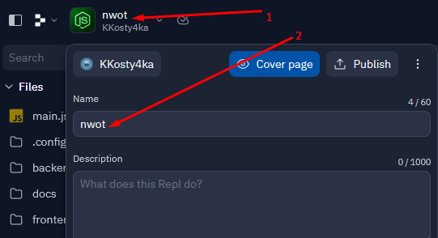

# Our World Of Text (for replit)

## Quickstart
* Create a new Repl. Chose `Import from GitHub` 
* Input `https://github.com/KKosty4ka/NodeWorldOfText` as the GitHub URL. Make sure the language is set to `Node.js` and import the repository. 
* When it finished importing, open the `Git` tool, and switch to the `for-repl-it` branch. If it asks you to overwrite some changes, click `Overwrite and continue`. 
* Click the big green `Run` button.
* Create your account when it asks you to. It will become OP. 
* Congratulations, you now have an OWOT server running at `repl_name.your_name.repl.co`

## Further configuration
* You can rename the Repl by clicking on its name. 

## Common Issues
* If you're encountering issues with `nwot_error_logs.zip`, please delete the zip file and try again.
* If you're receiving node-gyp errors while installing the modules via NPM, please ensure you've got some compiling tools installed on your system. If you have any further questions, be sure to ask us on Discord.

## License
Our World of Text is licensed under the [MIT License](https://github.com/system2k/nodeworldoftext/blob/master/LICENSE).